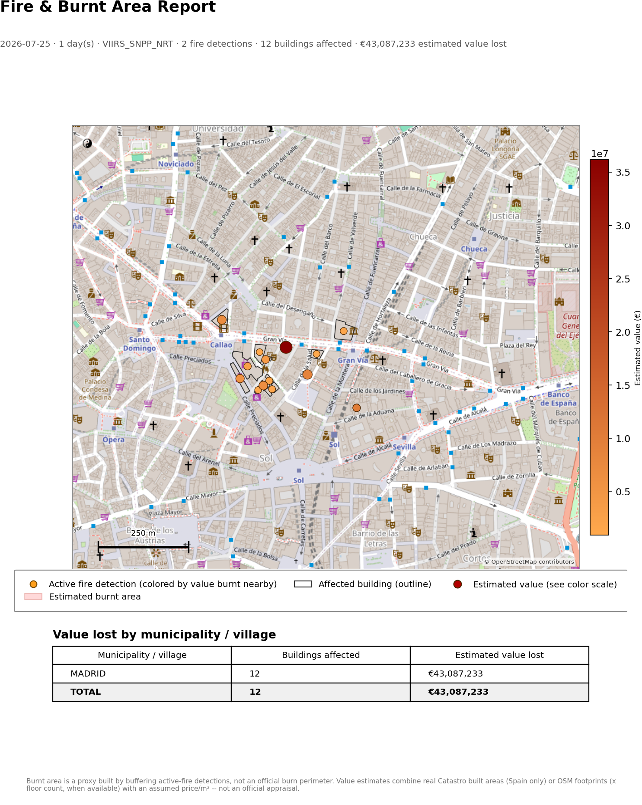

# Fire & Burnt Area Analysis

A Flask + Leaflet tool for exploring active wildfires, estimating the area
they've burned, overlaying the buildings in that area, and estimating the
monetary value at risk — with a one-click PNG report you can save or share.



*Illustrative example: real Madrid building footprints and street map from
OpenStreetMap, with sample fire detections and value figures for
demonstration.*

## What it does

- **Draw a box anywhere on the map**, pick a date range and sensor, and hit
  Analyze.
- **Active fire detections** come from [NASA FIRMS](https://firms.modaps.eosdis.nasa.gov/)
  (VIIRS/MODIS satellite thermal anomalies), near-real-time or historical.
- **Estimated burnt area** is built by buffering each fire detection by
  roughly its sensor's pixel footprint and dissolving the buffers together —
  a practical proxy, not an official burn-perimeter product (FIRMS gives
  points, not perimeters).
- **Building footprints** come from OpenStreetMap (via the Overpass API);
  the app cross-references them against the burnt-area estimate to flag
  which buildings are affected.
- **Value-lost estimation** (Spain only): for each affected building, the
  app looks up its real official built floor area, land-use type, and
  construction year from Spain's public [Catastro](https://www.catastro.hacienda.gob.es/)
  service, then multiplies by a configurable price/m² (editable per use
  type) to produce a market-value *estimate* — not an official appraisal.
  Catastro does not expose official assessed value (`valor catastral`) to
  unauthenticated callers, so this is the closest a free public source gets.
  Buildings with no cadastral match (outside Spain, or Catastro
  unavailable) fall back to their OSM footprint area × floor count (from
  OSM's `building:levels` tag, when present).
- **Municipality breakdown**: value lost is grouped by municipality/village,
  using Catastro's own municipality field when a building matches, or a
  spatial lookup against real OpenStreetMap administrative boundaries
  otherwise.
- **Switchable basemap**: OpenStreetMap or Esri World Imagery satellite.
- **Exportable PNG report**: title, stats, the map (with basemap, burnt
  area, affected buildings colored/sized by estimated value, fire
  detections colored/sized by value burnt nearby, and the top 5
  municipality boundaries by value with labels), a legend, and a
  value-by-municipality table.
- **Recent & example boxes**: re-run an analysis on a previously-used box
  from a dropdown, or save any box as a named example — both persisted in
  your browser.
- Mobile-friendly responsive layout with a collapsible sidebar.

## Limitations, on purpose

This is a rapid-assessment tool, not a substitute for official damage
assessment:

- Burnt area is a geometric proxy from point detections, not a mapped burn
  perimeter (compare to products like MTBS or MCD64A1 for that).
- Value estimates combine real built-area data with an assumed market
  price/m² — they are not official appraisals, and Catastro's actual
  assessed value is legally protected data this app cannot access.
- Value-lost estimation only works for buildings in Spain.
- Both Catastro and OpenStreetMap's Overpass API are free public services
  with their own rate limits. The app retries transient failures, falls
  back to an independent Overpass mirror if the primary is throttled, and
  caches Catastro lookups on disk to avoid re-spending its hourly quota —
  but a large-enough analysis can still hit a wall until the quota resets.

## Running it locally

```
python -m venv .venv
.venv\Scripts\pip install -r requirements.txt      # Windows
# source .venv/bin/activate && pip install -r requirements.txt   # macOS/Linux

copy .env.example .env      # Windows; cp on macOS/Linux
# then edit .env and set FIRMS_MAP_KEY (free key: https://firms.modaps.eosdis.nasa.gov/api/map_key/)

.venv\Scripts\python.exe app.py
```

Open http://127.0.0.1:5000.

## Deploying

The repo is set up for [Render](https://render.com)'s free tier
(`render.yaml` + `Procfile`, gunicorn as the production server). Push to a
GitHub repo, connect it as a Render Blueprint, and set `FIRMS_MAP_KEY` in
the dashboard when prompted (it's deliberately excluded from the repo).

## Project layout

```
app.py                       Flask routes
services/
  firms.py                   NASA FIRMS active-fire fetch
  estimate.py                Burnt-area proxy, affected-building matching, value-per-fire
  buildings.py               OSM building footprints (Overpass)
  municipalities.py          OSM administrative boundaries (Overpass)
  overpass.py                Shared Overpass client (retry + mirror fallback)
  catastro.py                Spain's Catastro web services client
  catastro_cache.py          On-disk cache for Catastro lookups
  valuation.py               Value-lost estimation and municipality grouping
  basemap.py                 OSM/satellite tile fetching for the PNG report
  report.py                  PNG report rendering (matplotlib)
templates/index.html         Page shell
static/js/map.js             Leaflet map, UI wiring, API calls
static/css/style.css         Styling
```

## A note on data sources

Everything here is free and requires no paid API key:
[NASA FIRMS](https://firms.modaps.eosdis.nasa.gov/) (free key, sign-up
required), [OpenStreetMap](https://www.openstreetmap.org/copyright) via the
Overpass API, [Spain's Catastro](https://www.catastro.hacienda.gob.es/) free
web services, and [Esri World Imagery](https://www.arcgis.com/home/item.html?id=10df2279f9684e4a9f6a7f08febac2a9)
for the optional satellite basemap. Please respect each service's usage
policy if you extend this for heavier use.
